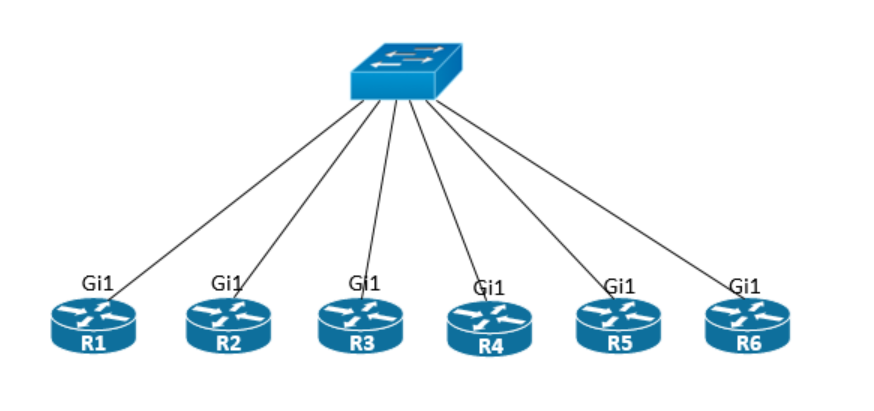
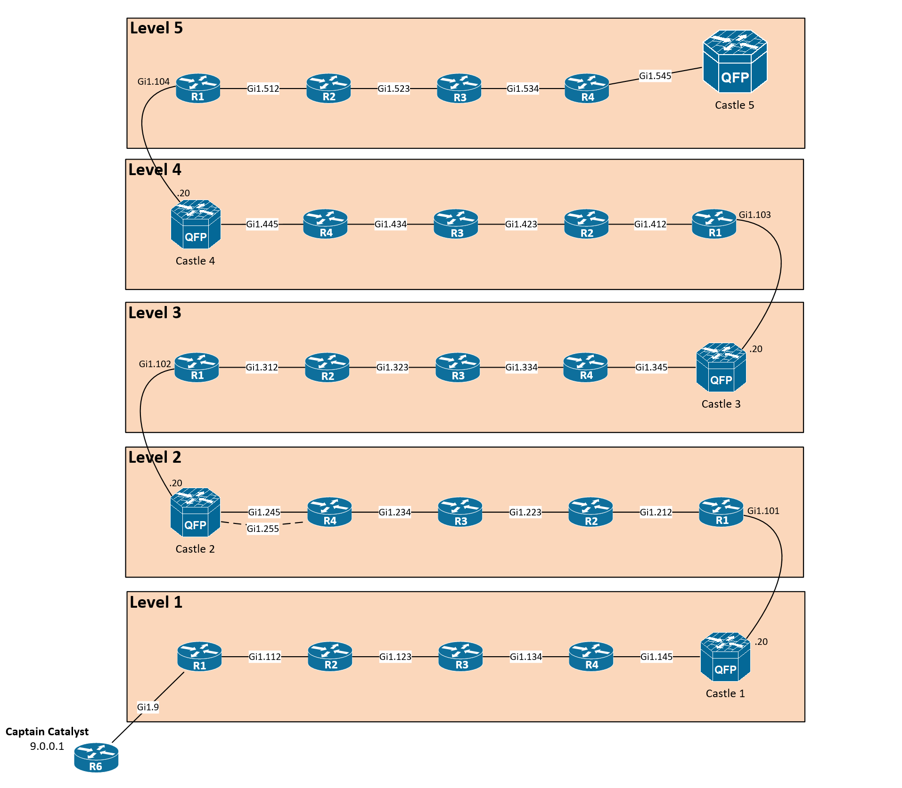

# IOS Adventures
One day, the IOS Kingdom was invaded by the Junipers, a tribe of network devices capable of using powerful dark magic. Their magic was used to transform all the IOS routers into simple hubs and media converters, thus spelling the kingdom's downfall. Only the daughter of the IOS King, Princess Cattools, can undo the spell and restore her routers back to glory, but she is being held captive by King Junos himself. Captain Catalyst hears of the princess's plight, and sets out on a quest to topple the Juniper Tribe and save the once-restful kingdom.

## Preparations
You need six CSR:s and one switch connected according to the topology. The switch needs to forward 802.1q tagged frames for all vlans on all interfaces, other than that it is not involved in the gameplay. 



How you do management of the routers is up to you but you need to deploy the initial configurations onto them. You should probably not use copy and paste to do this, especially not for R5 because of the large number of configuration lines. 

Example, using a mgmt vrf on interface Gi2:
```
R5(config)#ip http client source-interface GigabitEthernet2
R5#copy http://<your-file-server>/initial-configs/R5.txt running-config
```

## Gameplay
You play the role of Captain Catalyst (R6) and you control R1 - R4. You start at the bottom (see below) and need to configure your way through all of the levels. The R5 router is used to serve as the castles and each castle has a virtual telnet chamber at 100.X.0.20/32 port 3001 where X is the level number. A level is completed when Captain Catalyst has entered the telnet chamber and searched for the princess. You need to configure routing on each level (VRF instance on R1 - R4) according to the level requirements and then give the castles the prefix for Captain Catalyst (9.0.0.0/31) also according to the level requirements. This is the only way to make the castle give back the chamber prefixes and thereby achieving connectivity to the chamber. Each chamber is protected by a username and a password. The username is LevelX (X is the level number) and the password will be attached to the chamber prefix that you get from the castle. No password should be entered in dotted-decimal format.

Once you have successfully searched through a chamber you will open the castle backdoor (vlan 101-104) to the next level thus making your progress a little further. To get the Captain Catalyst prefix between levels you run eBGP between the Level VRF on R1 and the castles over the directly connected links, the level routers are in AS 1337 and all the castles are in AS 400. You can go into a castle chamber as many times as you want to but when you establish peering from the above level you will lose access to that chamber. But don't worry because if you succeeded with that it means you have unlocked the next level and there is another chamber for you to visit. There are many pitfalls, only the brave can prevail!



### Ground rules
- Do not change or add any IP addresses nor interface encapsulations from the initial configuration.
- Do not change any level nor routing protocol boundaries. Refer to level requirements and provided diagram.
- Static routes, tunneling and policy based routing is not permitted unless specifically stated.
- MOST IMPORTANT RULE: R5 is used to act as the castles, no login permitted nor needed besides the telnet chambers! The castles takes care of themselves. The running configuration of R5 will change as you progress in the game, therefore do not reapply the initial config of R5 nor reboot the box. 

## Level 1 - Rest in peace

Level requirements:
- Level IGP is RIP. 
- RIP timers should be trimmed down to one third of the default timers.
- The castle only accept RIP updates with a keyed message digest. The key ID is 1 and the authentication key is "Bellman-Ford".
- The castle does not accept broadcasted updates.
- The castle only accepts routes with an admin tag of 120. Note this applies to all routes sent to the castle.
- The castle only accepts routes with a maximum metric of 4.
- Our hero (R6) is the only true free spirit left in the kingdom. All protocols are allowed here, even static routing.
 
When you have met all the requirements it's time to enter the chamber of the Castle:
```
R6#telnet castle1
```

## Level 2 - DUAL Bridge

Level requirements:
- Level IGP is EIGRP, use ASN 2
- Do not send EIGRP hellos to Castle 1.
- All EIGRP adjacencies must use SHA256 authentication. The authentication key is "unequal-cost".
- Instruct the castle to wait a maximum of 9 seconds before tearing down any EIGRP adjacency.
- The castle only accepts routes with an admin tag of 90. Note this applies to all routes sent to the castle.
- The castle only accepts IP packets marked with type of service 90 (HEX). Note this applies to all packets sent to the castle.
- The castle main gate (Gi1.245) is monitored by malicious SRX guards and telnet traffic is blocked.
- By announcing the prefix of Captain Catalyst (9.0.0.0/31) to the castle you open a smaller gate next to the main gate. Here you can run EIGRP with the castle as well but there is only a single UDP port (4343) open for data plane. The castle is at 10.2.55.5 and uses EIGRP Topology ID 10 and LISP Encapsulation and Instance ID 88. 
- Create a new interface on R4, you must not put this in any VRF. IP address: 10.2.55.4/24, Dot1Q tag: 255.
- The second gate will be closed after the level is completed. Telnet sessions to other castles is not affected by Castle 2.

When you have met all the requirements it's time to enter the chamber of the Castle:
```
R6#telnet castle2
```
Note you cannot telnet the chamber through the main gate, your telnet session must enter the castle some other way.

## Level 3 - Djikstra's Island

Level requirements:
- Level IGP is OSPF, use process id 3.
- Do not send OSPF hellos to Castle 2.
- The area between R1 and R4 is the backbone area.
- All routers should try to resolve the names of router ID:s on neighboring devices.
- The castle verifies that received OSPF packets have not been sent more than one hop away.
- The castle only accepts routes with an admin tag of 110 and a metric of 89. Note this applies to all routes sent to the castle.
- The castle needs to be adjacent in area 1-5. These neighbor establishments must be done in ascending order.
- No External nor ASBR LSA:s can be allowed in area 1-4.
- The castle is using a static OSPF cost on all links independent of bandwidth.
- The castle will not install any default route in RIB.
- The castle will only accept a maximum of twelve LSA:s in the LSDB besides it's own, be thoughtful about your advertisments. If the adjacency flaps this is probably the cause.

When you have met all the requirements it's time to enter the chamber of the Castle:
```
R6#telnet castle3
```

## Level 4 - FEC Frenzy

- Level IGP is IS-IS, tag the process with 4.
- On router R1 - R4 create interface Loopback 10 with IP 10.0.0.X/32 (X = router number) and advertise them in IGP.
- Only these loopback prefixes should be installed in RIB from IS-IS.
- The castle is blocking all IP packets from the level for data plane but there is an opening for BGP. Use it to setup a VPN for Captain Catalyst. 
- Use directly connected links for any eBGP peerings.
- All eBGP peerings on this stage must be authenticated with the password "next-hop-unchanged"
- Only necessary address families should be negotiated with the castle.
- Don't advertise any more NLRI than needed from the level to the castle.
- This level must not be any different from an regular IP routed level when it comes to handling of TTL for data plane.

When you have met all the requirements it's time to enter the chamber of the Castle:
```
R6#telnet castle4
```

## Level 5 - Last Mile Route

 - Level IGP is OSPF, use process id 5.
 - The castle is using network type point-to-point with default OSPF timers.
 - The chamber itself cannot be advertised with OSPF, only BGP. However the main gate does not speak BGP. The princess knows about this and have made some arrangements to the castle from the TCAM cell where she is locked. The details about this is not fully known to anyone. 
 - The castle can only run BGP in the subnet 10.5.45.0/24.
 - You are allowed to create as many tunnel interfaces as needed on the level routers.
 - The castle filters out the hero prefix by default. Give the castle what it asks for to unlock more prefixes. Use only built-in BGP features and use loopback 536 on the level routers to populate the BGP table as needed.

When you have met all the requirements it's time to enter the chamber of the Castle:
```
R6#telnet castle5
```

## Final words
This was developed and tested on IOS XE Software Version 03.17.00.S, IOS Software Version 15.6(1)S, Embedded Event Manager Version 4.00. Using other versions may not work as intended and can therefore possibly ruin the game experience. Testing of other setups and feedback of the game is much appreciated.

If you're having trouble getting your prefixes to or through the castles make sure that you follow the level requirements completely but also think about any technical limitations that you can hit with this kind of setup. With that said good luck, it's not an easy game!
